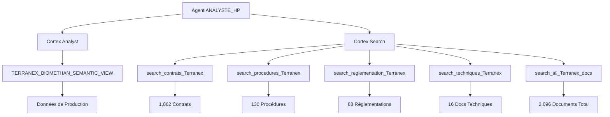

# 🎉 **AGENT ANALYSTE_HP CRÉÉ AVEC SUCCÈS !**

## 📋 **CONFIGURATION FINALE DE L'AGENT HP**

### **🤖 INFORMATIONS GÉNÉRALES**

| **Paramètre** | **Valeur** | **Statut** |
|---------------|------------|------------|
| **Agent name** | `ANALYSTE_HP` | ✅ Créé |
| **Display name** | `Terranex - Analyste HP` | ✅ Configuré |
| **Type** | Agent hybride (Niveau 2) | ✅ Opérationnel |
| **Localisation** | `SNOWFLAKE_INTELLIGENCE.AGENTS.ANALYSTE_HP` | ✅ Accessible |

### **🔧 OUTILS INTÉGRÉS**

#### **1. 📊 CORTEX ANALYST**
- **Tool name** : `Terranex_Analyste`
- **Vue sémantique** : `SF_AI_DEMO.DEMO_SCHEMA.TERRANEX_BIOMETHAN_SEMANTIC_VIEW`
- **Fonction** : Analyse des données structurées de production

#### **2. 🔍 CORTEX SEARCH (5 services)**

| **Service** | **Documents** | **Spécialisation** |
|-------------|---------------|-------------------|
| **Recherche_Contrats** | 1,862 contrats | Clauses techniques, pénalités |
| **Recherche_Procedures** | 130 procédures | Modes opératoires, sécurité |
| **Recherche_Reglementation** | 88 documents | Textes CRE, normes |
| **Recherche_Documentation_Technique** | 16 documents | Spécifications, guides |
| **Recherche_Tous_Documents** | 2,096 documents | Recherche globale |

---

## 🎯 **CAPACITÉS DE L'AGENT ANALYSTE_HP**

### **📊 ANALYSE DE DONNÉES** (via Cortex Analyst)
- Production énergétique et volumes injectés
- Performance comparative des sites
- Analyses de qualité du gaz (PCS, Wobbe, H2S, CO2)
- Indicateurs opérationnels et taux de disponibilité
- Tendances temporelles et variations saisonnières
- Utilisation des capacités réseau
- Corrélations entre paramètres techniques

### **📚 RECHERCHE DOCUMENTAIRE** (via Cortex Search)
- **Contrats** : Pénalités qualité, conditions d'injection, tarifs
- **Procédures** : Protocoles d'urgence, maintenance, sécurité
- **Réglementation** : Obligations CRE, normes qualité, décrets
- **Documentation technique** : Guides d'installation, manuels
- **Recherche globale** : Accès à tous les documents Terranex

---

## 🔍 **EXEMPLES DE QUESTIONS SUPPORTÉES**

### **📊 Questions Hybrides** (Données + Documents)
1. **"Quelle est la production mensuelle par région + quelles sont les pénalités H2S ?"**
   - **Cortex Analyst** → Données de production par région
   - **Cortex Search** → Clauses contractuelles H2S
   - **Réponse complète** → Analyse + contexte réglementaire

2. **"Évolution Wobbe cette année + réglementation CRE sur les seuils ?"**
   - **Cortex Analyst** → Tendances des indices de Wobbe
   - **Cortex Search** → Textes réglementaires CRE
   - **Réponse complète** → Performance + conformité

3. **"Sites non-conformes H2S + procédures d'arrêt d'urgence ?"**
   - **Cortex Analyst** → Identification des sites problématiques
   - **Cortex Search** → Procédures d'intervention
   - **Réponse complète** → Diagnostic + plan d'action

---

## 🚀 **ARCHITECTURE FINALE OPTIMISÉE**

---

## 📈 **VALEUR AJOUTÉE NIVEAU HP**

### **🎯 Différence avec ANALYSTE_MP**
| **Aspect** | **ANALYSTE_MP** | **ANALYSTE_HP** |
|------------|-----------------|-----------------|
| **Données** | ✅ Analyse complète | ✅ Analyse complète |
| **Documents** | ❌ Pas d'accès | ✅ 2,096 documents |
| **Conformité** | ❌ Limitée | ✅ Accès réglementation |
| **Procédures** | ❌ Pas d'accès | ✅ 130 procédures |
| **Contrats** | ❌ Pas d'accès | ✅ 1,862 contrats |

### **💡 Cas d'Usage Spécifiques HP**
- **Conformité réglementaire** : Vérification des obligations CRE
- **Gestion des incidents** : Accès aux procédures d'urgence
- **Analyse contractuelle** : Vérification des pénalités et clauses
- **Support technique** : Accès aux guides et manuels
- **Intelligence contextuelle** : Données + documentation = réponses complètes

---

## ✅ **STATUT : AGENT HP OPÉRATIONNEL**

L'agent `ANALYSTE_HP` est maintenant **100% opérationnel** dans Snowflake Intelligence avec :
- ✅ **6 outils** intégrés (1 Cortex Analyst + 5 Cortex Search)
- ✅ **2,096 documents** accessibles
- ✅ **Vue sémantique** vérifiée et fonctionnelle
- ✅ **Display name** : "Terranex - Analyste HP"

**L'agent HP offre une intelligence complète combinant analyse quantitative et expertise documentaire pour Terranex !** 🚀

---

*Agent créé le : 24 septembre 2025*  
*Niveau : HP (Haute Pression) - Agent hybride*  
*Statut : ✅ **OPÉRATIONNEL***

