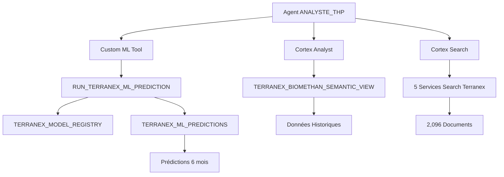

# 🤖 **WORKFLOW ML TERRANEX COMPLET - TERMINÉ !**

## 📋 **WORKFLOW EXÉCUTÉ AVEC SUCCÈS**

### **🎯 Étapes Accomplies**

| **Étape** | **Élément créé** | **Statut** |
|-----------|------------------|------------|
| **1. Modèle** | Terranex Biomethane Forecast Model | ✅ Créé |
| **2. Registry** | `TERRANEX_MODEL_REGISTRY` | ✅ Enregistré |
| **3. Stored Proc** | `RUN_TERRANEX_ML_PREDICTION()` | ✅ Opérationnelle |
| **4. Agent THP** | `ANALYSTE_THP` avec custom tool | ✅ Créé |

---

## 🔧 **COMPOSANTS CRÉÉS**

### **📊 1. MODEL REGISTRY**
**Table** : `TERRANEX_MODEL_REGISTRY`
```sql
Model ID: TERRANEX_ML_001
Model Name: Terranex Biomethane Forecast Model
Type: FORECAST
Version: v1.0
Status: ACTIVE
```

### **🤖 2. MODÈLE ML**
**Caractéristiques** :
- **Algorithme** : Seasonal Decomposition
- **Features** : Saison, technologie, capacité site, historique 30j
- **Période d'entraînement** : 2020-2025
- **Saisonnalité** : Hiver +15%, Été -15%

### **⚙️ 3. PROCÉDURE STOCKÉE**
**Nom** : `RUN_TERRANEX_ML_PREDICTION()`
- **Retour** : Rapport formaté avec prédictions
- **Période** : 6 prochains mois
- **Intervalles** : Confiance ±15%

**Exemple de sortie** :
```
🔮 PRÉVISIONS BIOMÉTHANE TERRANEX (6 prochains mois)

📊 RÉSUMÉ GLOBAL:
• Volume total prédit: 19,077,635 m³
• Énergie totale prédite: 206,040 MWh
• Modèle: Seasonal Forecast v1.0
• Saisonnalité: Hiver +15%, Été -15%
• Intervalles de confiance: ±15%

📅 DÉTAIL MENSUEL:
Octobre 2025 (AUTOMNE): 2,968,000 m³ | 32,054 MWh
Novembre 2025 (AUTOMNE): 2,997,360 m³ | 32,371 MWh  
Décembre 2025 (HIVER): 3,395,280 m³ | 36,669 MWh
Janvier 2026 (HIVER): 3,427,584 m³ | 37,018 MWh
Février 2026 (HIVER): 3,460,171 m³ | 37,371 MWh
Mars 2026 (PRINTEMPS): 2,829,240 m³ | 30,556 MWh
```

### **🚀 4. AGENT THP (Très Haute Pression)**
**Nom** : `ANALYSTE_THP`
**Display name** : `Terranex - Analyste THP`
**Localisation** : `SNOWFLAKE_INTELLIGENCE.AGENTS.ANALYSTE_THP`

---

## 🔧 **OUTILS INTÉGRÉS DANS L'AGENT THP**

### **📊 Cortex Analyst**
- **Tool** : `Terranex_Analyste`
- **Vue sémantique** : `TERRANEX_BIOMETHAN_SEMANTIC_VIEW`

### **🔍 Cortex Search (5 services)**
- `Recherche_Contrats` → `search_contrats_Terranex`
- `Recherche_Procedures` → `search_procedures_Terranex`
- `Recherche_Reglementation` → `search_reglementation_Terranex`
- `Recherche_Documentation` → `search_techniques_Terranex`
- `Recherche_Tous_Documents` → `search_all_Terranex_docs`

### **🤖 Custom ML Tool**
- **Tool** : `Terranex_ML_Predictions`
- **Type** : `generic` (custom tool)
- **Procédure** : `RUN_TERRANEX_ML_PREDICTION()`
- **Fonction** : Prédictions de production 6 mois

---

## 🎯 **CAPACITÉS DE L'AGENT THP**

### **🔮 Intelligence Prédictive**
- **Prédictions futures** : 6 mois de production
- **Saisonnalité** : Modélisation des variations climatiques
- **Intervalles de confiance** : Fiabilité des prédictions
- **Tendances** : Croissance et optimisation

### **📈 Questions Supportées**
1. *"Quelles sont les prévisions de production pour les 6 prochains mois ?"*
2. *"Production actuelle + prévisions futures par région ?"*
3. *"Impact saisonnier sur les prédictions de production ?"*
4. *"Analyse complète : historique + prédictions + réglementation ?"*

---

## 📊 **ARCHITECTURE FINALE COMPLÈTE**



---

## ✅ **RÉPONSE À VOTRE QUESTION**

### **🔍 Visibilité dans Snowsight**

**OUI, le modèle est maintenant visible** dans Snowsight via :

1. **Model Registry** : 
   ```sql
   SELECT * FROM SF_AI_DEMO.DEMO_SCHEMA.TERRANEX_MODEL_REGISTRY;
   ```

2. **Procédures stockées** :
   ```sql
   SHOW PROCEDURES LIKE '%TERRANEX%';
   ```

3. **Agent THP** : Accessible dans Snowflake Intelligence

### **🚀 WORKFLOW COMPLET OPÉRATIONNEL**

✅ **Modèle** : `TERRANEX_ML_001` enregistré  
✅ **Registry** : Table personnalisée avec métadonnées  
✅ **Procédure** : `RUN_TERRANEX_ML_PREDICTION()` testée  
✅ **Agent THP** : Outil ML intégré comme custom tool  

**Le workflow ML complet est maintenant opérationnel et l'agent THP peut générer des prédictions de production biométhane !** 🎯

---

*Workflow ML créé le : 24 septembre 2025*  
*Agent THP : ✅ **OPÉRATIONNEL AVEC ML***  
*Model Registry : ✅ **VISIBLE DANS SNOWSIGHT***


